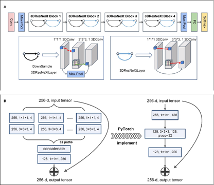

## Introduction

This repository was code for “Non-contrast CT-based deep learning model for prediction of long-term functional outcome in acute ischemic stroke”

This Medical Deep Learning Framework is developed based on https://github.com/open-mmlab/mmclassification 

To further match 3D medical image, we developed 3D Convolutional Neural Network and 3D data transformation

Supported neural networks：

- [x] ResNet (3D)
- [x] ResNeXt (3D)
- [x] SE-ResNet
- [x] SE-ResNeXt
- [x] RegNet
- [x] ShuffleNetV1
- [x] ShuffleNetV2
- [x] MobileNetV2
- [x] MobileNetV3
- [x] Swin-Transformer

**For 3D ResNeXt18 mentioned in this paper, the architecture:**

